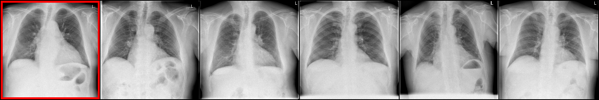

# CBMIR (Content-based medical image retrieval)
Image similarity search for radiology images with BoVW (Bag-of-Visual-Words), HOG and CNN-extracted descriptors.

The system and the retrieval methods are described in the [paper](https://raw.githubusercontent.com/dbarac/cbmir/main/cbmir-paper.pdf?token=AINDYDCPXH53KFWRFFQPBDDBHJWIE).

## Steps for reproducing results from the paper
1. Place image data arrays (`images_matrix_single.npy` and `test_images_matrix_single.npy`, both should be
   float32 arrays) and pandas dataframes (`df_paper_fixed_stage_2` and `df_paper_fixed_test_stage_2`)
   in the `data/` directory.
2. Prepare all retrieval methods (build visual vocabulary, extract dataset descriptors and save models).
   ```bash
   $ cd cbmir
   $ python prepare_methods.py
   ```
3. Run the test script:
   ```bash
   $ python test.py
   ```
Note: Relative paths are used so the scripts should be run in the directory where they are located.

## Usage examples
### Test image retrieval for query images
After running `prepare_methods.py`:
1. Save images from the raw data arrays (run in `cbmir/` directory):
   ```bash
   $ python save_images.py
   ```
   Images will be saved in `data/images/` and `data/test_images/`.
2. Open the jupyter notebook `image-retrieval.ipynb` and run the retrieval code.
   ```bash
   $ cd cbmir
   $ jupyter-notebook
   ```
### Code example
Load a query image, retrieve nearest neighbours with a CNN, re-rank the results with HOG,
and save an image grid of the query image and the retrieved images: [example.py](./cbmir/example.py)
```python
import dataset
from utils import *
from cnn import *
from hog import *

# retrieval methods
cnn = CNNModel.load_model("./retrieval_methods/cnn_final.pkl")
hog = HOGModel.load_model("./retrieval_methods/hog_final.pkl")

path = "../data/test_images/585.png"
query_img = cv2.imread(path, cv2.IMREAD_GRAYSCALE)

k = 5
retrieved_idxs = cnn.find_knn(query_img, k)
reranked_idxs = hog.sort_by_distance(query_img, retrieved_idxs)

imgs = get_neighbour_imgs(
    query_img, dataset.train_array_path, retrieved_idxs, k
)
imgs = make_image_grid(imgs, n_per_row=k+1)
cv2.imwrite("retrieved.png", np.transpose(imgs, (1, 2, 0)))
```
Output:


## Used packages
* numpy
* matplotlib
* scipy
* pandas
* torch
* torchvision
* faiss-cpu
* opencv-python
* opencv-contrib-python

Tested with python 3.7 on Linux
